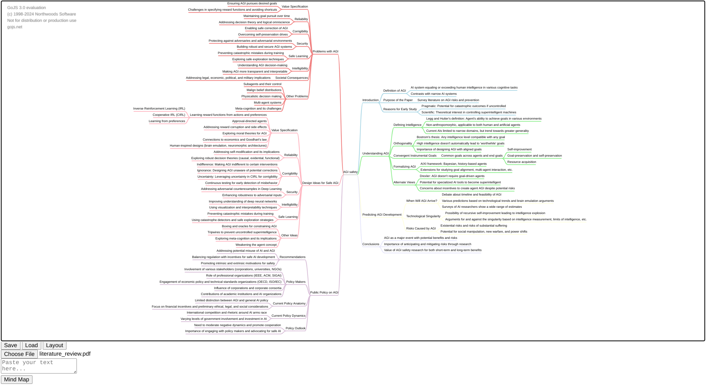

# AI Mind map generator

## Features:
* Upload text or PDF files to generate mind maps from their content.
* Paste or write text directly.
* Create, edit, and manipulate nodes to customize mind maps.
* Zoom in and out.
* Download as JSON or load from JSON.
* Translate mind map content to Polish.
* Automatically adjust the layout for optimal visualization.

## Example
* Upload png article or research paper and generate.
* Result:

## Todo:
* Load mindmap from screenshot.
* Export to obsidian mind map.
